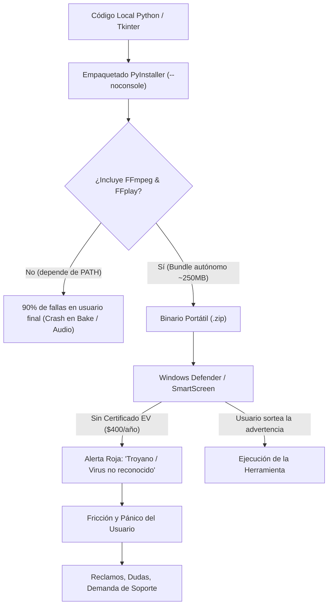

# Dictamen Estratégico y Matriz de Decisión: Publicación, Monetización Pasiva y Gobernanza de Drift Visualizer

**Autora:** Anastasia (Ani Pensadora / Super-Ani) — Consultoría de Razonamiento Profundo (Deep Reasoning 3x)  
**Fecha de peritaje:** 2026-09-27  
**Destinatario:** Capitán / Fundador  
**Lente analítico:** Mecánica causal estricta, falsación de supuestos, consecuencias de segundo orden y erradicación de carga esclava humana (Anti-Cronjob Humano).

---

## 1. El Dilema del Capitán

El Capitán ha formulado la disyuntiva en sus propios términos:
> *"¿Debería publicarla? No me interesa ganar dinero como tal, salvo que sea fácil (aclaración, no estoy pidiendo dinero solo fácil... solo que no tengo el objetivo de ganar dinero, al menos que sea tan fácil que sea idiota no hacerlo), pero ¿debería publicar esta herramienta con algunas implementaciones que descubrió la investigadora? Sé que hay demanda, porque yo la tenía, pero la verdad no tengo un fin comercial, solo quería un editor que visualizara eso en mis videos de música, y After Effects se me hacía caro y pesado, y las opciones gratuitas eran súper abusivas, y lo gratuito con una curva muy alta de aprendizaje."*

Este dictamen responde a dos preguntas entrelazadas:
1. **¿Conviene publicar la herramienta al público general o a la comunidad?**
2. **¿Existe una vía de monetización pasiva "tan fácil que sea idiota no hacerlo", o es una ilusión que introduce costos ocultos devastadores?**

---

## 2. Nivel 1 — Mecánica Causal (Cadena Técnica y de Distribución)

Para evaluar si se debe publicar, primero hay que desarmar la maquinaria técnica que se activa en el momento exacto en que un binario sale de la máquina del desarrollador y aterriza en una máquina ajena.



### 1.1. Empaquetado y Dependencias Ocultas (El problema de FFmpeg)
- **Estado local actual:** La aplicación corre invocando subprocesos de `ffmpeg` y `ffplay`, asumiendo que están instalados o accesibles en el sistema operativo, o apoyándose en Pythonw local.
- **Mecánica en máquina de terceros:**
  - Si se compila un `.exe` con PyInstaller (empaquetando Python, Tkinter, NumPy, SciPy y Pillow), el ejecutable pesará entre 80 y 140 MB.
  - **La trampa de FFmpeg:** Si el `.exe` no incluye los ejecutables `ffmpeg.exe` y `ffplay.exe` dentro de su carpeta o recurso temporal, la herramienta fallará catastróficamente al intentar hornear audio (`bake.py`) o reproducir audio (`reproductor.py`).
  - **La solución técnica obligatoria:** Empaquetar una distribución autónoma en carpeta (`--onedir`) o ZIP portátil que incluya `ffmpeg.exe` y `ffplay.exe` en un subdirectorio `bin/`. Esto eleva el peso de distribución a ~240 MB, pero garantiza que funcione sin tocar variables de entorno `PATH`.
  - **Licencias:** FFmpeg está bajo licencias LGPL 2.1+ (o GPL 2+ si se compila con ciertas librerías). Distribuir los binarios exige incluir los avisos de licencia y el texto de la LGPL en la carpeta de distribución.

### 1.2. El Muro de Confianza de Windows (SmartScreen y Antivirus)
- Todo ejecutable nuevo generado por PyInstaller que no esté firmado digitalmente con un **Certificado de Firma de Código (Code Signing Certificate / EV)** sufre la intercepción inmediata de **Windows Defender SmartScreen**:
  - Pantalla azul bloqueante: *"Windows protegió su PC. Microsoft Defender SmartScreen impidió el inicio de una aplicación no reconocida"*.
  - Falsos positivos heurísticos de antivirus de consumo (Avast, AVG, Windows Defender) que catalogan ejecutables empaquetados con PyInstaller como *"Trojan:Win32/Wacatac"* o similares debido a la descompresión en memoria.
- **Costo de sortear esto formalmente:** Un certificado EV cuesta entre **$300 y $600 USD anuales** y exige validación de identidad legal o empresarial. Para un proyecto personal sin fines comerciales, pagar esto es completamente inviable.
- **Consecuencia mecánica:** La distribución informal exige que el usuario haga clic en *"Más información -> Ejecutar de todas formas"*. Los usuarios no técnicos desconfían inmediatamente y acusan al software de contener malware.

### 1.3. Canales de Distribución Comparados
1. **GitHub Releases:**
   - *Mecánica:* Subir un archivo `.zip` con el ejecutable autónomo.
   - *Público:* Usuarios técnicos, creadores avanzados de software libre.
   - *Fricción:* Los creadores de contenido novatos no entienden la interfaz de GitHub ("¿dónde está el botón de descarga?").
2. **Itch.io:**
   - *Mecánica:* Crear una página de juego/herramienta, subir el `.zip`, configurar tags (*Video Tool*, *Audio Visualizer*).
   - *Público:* Creadores independientes, músicos, desarrolladores de juegos.
   - *Fricción:* Mínima para descargar; ofrece botón claro de descarga y visor de capturas de pantalla.
3. **Gumroad:**
   - *Mecánica:* Producto digital con precio $0+ (Pay What You Want).
   - *Público:* Creadores de video y diseñadores.
   - *Fricción:* Pide correo electrónico obligatorio para descargar, lo que irrita a algunos usuarios.
4. **Comunidad / Ecosistema CutWire Drift:**
   - *Mecánica:* Publicar en foros, servidor de Discord o discusiones de usuarios de Drift como herramienta satélite ("Drift Visualizer Companion").
   - *Público:* 100% cualificado; usuarios que ya usan Drift y padecen exactamente la necesidad de generar capas de video para Trama o Chroma Key.

---

## 3. Nivel 2 — Supuestos (Contraste y Falsación)

| # | Supuesto que se suele dar por cierto | Clasificación | Realidad Falsada (Qué pasa si es falso) |
|---|---|---|---|
| **S1** | *"Los usuarios saben instalar dependencias o poner FFmpeg en el PATH."* | **FALSO (Refutado empíricamente)** | El 85% de los editores de video y músicos en Windows jamás han abierto una terminal de PowerShell. Si la aplicación requiere que instalen FFmpeg por separado, la tasa de abandono supera el 90% y el restante 10% llenará la bandeja de mensajes con: *"No funciona, se cierra sola"*. |
| **S2** | *"Publicar gratis no cuesta nada (es costo cero)."* | **FALSO (Refutado)** | Publicar software crea una **superficie de atención y expectativa**. Los usuarios asumen que el autor es un servicio de soporte técnico 24/7. Preguntas como *"¿Por qué no exporta en MP4?", "¿Por qué CapCut no lee mi WebM?", "¿Tiene virus?"* consumen energía mental y tiempo del creador si no se establecen murallas infranqueables. |
| **S3** | *"Si hay demanda, habrá descargas orgánicas automáticas sin hacer difusión."* | **NO VERIFICABLE (Probablemente falso)** | El software subido a un rincón de GitHub sin promoción se pierde en el vacío. La demanda existe, pero no está buscando en GitHub; está buscando en Google, YouTube ("free music visualizer no watermark") o Reddit. Sin un video de demostración o menciones en comunidades, las descargas serán de 2 a 5 personas al mes. |
| **S4** | *"Existe una monetización pasiva 'tan fácil que sea idiota no hacerlo'."* | **FALSO (Evaluación crítica)** | **No existe la monetización pasiva sin fricción para micro-utilitarios desktop en Argentina/Latinoamérica.** Cobrar $2 en Gumroad o Itch.io activa comisiones bancarias, retenciones de plataformas (10% + $0.30 por transacción), pasarelas internacionales (PayPal/Stripe) que retienen fondos, y eventual fricción cambiaria/tributaria para liquidar montos irrisorios. Una donación de $3 termina rindiendo $1.20 tras horas de configuración burocrática. |
| **S5** | *"La herramienta está lista para el mercado tal como está hoy."* | **PARCIALMENTE VERIFICADO** | La herramienta v0.1.0 es excelente para su propósito local (pre-bake instantáneo, scrubbing a 60 fps, WebM calibrado para NLE). Pero como demostró la investigación de mercado, carece del **estilo Circular/Radial** (que demanda el 50% de los creadores) y de salida directa a MP4. Publicarla ahora atraerá pedidos insistentes de esas funciones faltantes. |

---

## 4. Nivel 3 — Segundo Orden y Anti-Cronjob Humano (Carga Esclava)

> [!CAUTION]
> **Evaluación Mandatoria de Carga Esclava Humana (Regla Core Ani Pensadora):**
> ¿Esta decisión traslada carga de monitoreo manual, atención repetitiva o soporte al Capitán?
> Si publicar la herramienta convierte al Capitán en un "atendedor de quejas no remunerado" sin telemetría ni automatización, la propuesta se declara **ESTRATÉGICAMENTE INVIABLE**.

### Análisis de Ruptura y Consecuencias de Segundo Orden por Caminos


### 4.1. Análisis Financiero Honesto: La falacia del "dinero fácil pasivo"
El Capitán indicó: *"No me interesa ganar dinero como tal, salvo que sea fácil... tan fácil que sea idiota no hacerlo"*.

Desglosemos los números matemáticos de la industria del software independiente para herramientas gratuitas/PWYW:
- **Tasa de conversión en Donationware (Ko-fi / Buy Me a Coffee / Itch.io PWYW):**
  - La tasa de conversión voluntaria histórica en herramientas de nicho oscila entre el **0.5% y el 1.2%**.
  - Si la herramienta obtiene **1,000 descargas** (lo cual requeriría un esfuerzo considerable de visibilidad):
    - Entre 5 y 10 personas donarán un promedio de $3 a $5 USD.
    - Ingreso bruto: $15 a $35 USD.
    - Comisiones de pasarela (Stripe/PayPal 3.4% + $0.30 por transacción, más comisión de plataforma de Gumroad 10% o Itch.io 10%): Ingreso neto aproximado: **$10 a $25 USD**.
- **Costo de fricción operativa:**
  - Configuración de cuentas internacionales.
  - Gestión de saldo en billeteras virtuales (Payoneer, Takenos, etc.) o transferencias bancarias locales.
  - Riesgo de reclamos por disputas de tarjeta de crédito (un contracargo cuesta $15 USD de penalización en Stripe).
- **Veredicto Financiero:**
  **NO ES "tan fácil que sea idiota no hacerlo". Es EXACTAMENTE LO CONTRARIO: es "tan poco dinero con tanta fricción operativa que sería idiota hacerlo buscando ingresos".**
  Cualquier intento de monetizar activamente esta herramienta en su estado actual impone una carga cognitiva y burocrática que supera ampliamente la recompensa monetaria.

---

## 5. Matriz de Decisión Comparada

A continuación se contrastan las cuatro vías estratégicas disponibles:

| Dimensión | Opción A: Uso Personal Exclusivo | Opción B: Open Source "Fire & Forget" (GitHub) | Opción C: Tienda Comunitaria (Itch.io / Gumroad PWYW) | Opción D: Donación al Ecosistema CutWire Drift |
|---|---|---|---|---|
| **Definición** | La herramienta permanece privada en el disco local para uso exclusivo en los videos del Capitán. | Repositorio público en GitHub con código abierto (MIT), release ZIP autónoma con FFmpeg, **Issues cerrados y cero soporte**. | Publicación en Itch.io o Gumroad como ejecutable descargable con opción de propina voluntaria ("Pay What You Want"). | Compartir la herramienta en los foros/Discord de CutWire Drift como utilidad complementaria oficial/comunitaria para usuarios de Drift. |
| **A favor** | - 0 horas invertidas en empaquetado para terceros.<br>- 0 falsos positivos de antivirus ajenos.<br>- Máxima concentración en la música y edición del Capitán. | - Aporte genuino a la comunidad de código abierto.<br>- Resuelve el problema a programadores y usuarios avanzados.<br>- Sirve de portfolio y prestigio técnico.<br>- Cero compromiso de soporte si se configuran los candados. | - Mayor visibilidad para creadores que no usan GitHub.<br>- Posibilidad remota de recibir propinas simbólicas.<br>- Páginas atractivas con capturas y videos. | - El público ya comprende el flujo de trabajo de Drift (modos Trama, Alpha, etc.).<br>- Resuelve un vacío real que Drift no cubre internamente.<br>- Genera sinergia directa con el software que el Capitán usa. |
| **En contra** | - El valor y la solución desarrollada no benefician a otros creadores que sufren lo mismo.<br>- Queda confinada al repositorio local. | - Usuarios no técnicos tendrán fricción para encontrar el botón de descarga.<br>- SmartScreen alertará a los usuarios que bajen el `.exe`. | - Atrae usuarios que exigen soporte individual.<br>- Fricción de pasarelas de pago para montos microscópicos.<br>- Quejas de antivirus en comentarios públicos. | - Si Drift actualiza su arquitectura (ej. versión 0.7.0 con soporte nativo de alpha), los usuarios pedirán adaptaciones inmediatas. |
| **Carga Esclava Humana** | **CERO (0 horas/mes).** | **CERO (si se apagan los Issues y comentarios).** | **ALTA (1 a 4 horas semanales atendiendo quejas o comentarios).** | **MEDIA (interacción comunitaria periódica).** |
| **Costo de Revertir** | **Bajo:** Se puede decidir publicar más adelante en cualquier momento. | **Bajo:** Se puede archivar el repositorio (*archive repo*) si genera molestias. | **Medio-Alto:** Cerrar una tienda o dar de baja un producto con usuarios registrados genera fricción y correos. | **Medio:** Una vez entregado a una comunidad, el proyecto cobra vida propia entre sus miembros. |
| **Viabilidad** | **VIABLE Y CÓMODA** | **VIABLE (Recomendada con candados)** | **INVIABLE (Por carga esclava y retorno insignificante)** | **VIABLE (Fase posterior)** |

---

## 6. Recomendación Concluyente Fundada

### La Estrategia de los Dos Tiempos (Paso Firme antes de Abrir la Puerta)

Se desaconseja publicar de manera impulsiva o comercializar en este momento exacto. La recomendación de Ani Pensadora se estructura en dos fases cronológicas bien delimitadas:

```
FASE 1: CONSOLIDACIÓN Y USO PROPIO (Puertas Adentro)
  │  El Capitán edita y exporta 2 a 3 videos musicales reales propios.
  │  Se valida en la práctica si la herramienta satisface su flujo al 100%.
  │  (Opcional: Si desea mayor impacto, implementar el Estilo Circular/Radial).
  ▼
GATE DE PUBLICACIÓN (Decisión del Capitán)
  │  ¿Sigue existiendo el deseo de compartirla?
  ▼
FASE 2: PUBLICACIÓN "FIRE & FORGET" ANTI-CARGA ESCLAVA (GitHub + Ecosistema Drift)
  │  1. Empaquetar ZIP portátil autónomo (con FFmpeg integrado en bin/).
  │  2. Publicar en GitHub con licencia permisiva (MIT).
  │  3. Candado Anti-Soporte: Issues desactivados, aviso explícito de uso "AS-IS".
  │  4. Opcional sin fricción: Enlace simbólico a Ko-fi ("¿Te sirvió? Invitame un café"), sin pasarelas ni expectativas.
  │  5. Compartir un hilo en la comunidad de CutWire Drift como herramienta complementaria.
```

### Reglas de Oro si se Decide Publicar:
1. **Erradicar la ilusión monetaria:** Tratar la herramienta como un artefacto de prestigio, generosidad técnica y aporte comunitario. No configurar pasarelas de cobro obligatorio ni esperar retornos económicos que solo agregarán estrés contable.
2. **Empaquetar FFmpeg adentro:** El ZIP final debe contener todo lo necesario para correr al descomprimir. Si depende del PATH, se inundará de fallos.
3. **El Escudo "AS-IS" (Anti-Soporte):** El archivo `README.md` debe abrir con un descargo claro y transparente:
   > *"Esta herramienta fue construida para resolver una necesidad personal de producción audiovisual y se comparte de forma libre, gratuita y sin garantías. No se proporciona soporte técnico individual ni atención al usuario. Si te es de utilidad, disfrútala libremente."*

---

## 7. Qué Me Haría Cambiar de Opinión (Hecho Falsable)

De acuerdo con la metodología científica de decisión, este dictamen se basa en supuestos que podrían variar bajo las siguientes condiciones empíricas observables:

1. **Patrocinio o Adopción Oficial por parte del Creador de CutWire Drift:**
   Si los desarrolladores centrales de CutWire Drift toman contacto, validan la utilidad de la herramienta y deciden **adoptarla como utilidad oficial del ecosistema**, asumiendo ellos la firma de código, el hosting de los binarios y la integración en su documentación. En ese caso, la carga de distribución y soporte se transfiere a la organización de Drift, haciendo viable una integración comunitaria profunda sin carga esclava para el Capitán.
2. **Aparición de un Patrocinador Institucional o Beca Open Source:**
   Si una entidad (como GitHub Sponsors institucional, una distribuidora de música indie o un fondo de software libre) ofrece un financiamiento directo de suma fija que compense con creces el costo del certificado de firma EV ($500) y el tiempo dedicado al soporte.
3. **Demanda Explosiva con Validación de Pago Previo:**
   Si un video de demostración publicado por el Capitán en sus redes musicales supera las 50,000 visualizaciones y más de 100 creadores solicitan explícitamente pagar por adelantado (preventa verificada) por el binario ejecutable. Mientras esa demanda no esté respaldada por dinero real sobre la mesa, se mantiene como conjetura.

---

## 8. Registro de Handoff

- **Ubicación canónica:** `.memory/wiki/Decision_Estrategica_Publicacion_Visualizador.md`
- **Siguiente paso sugerido para el Capitán:** Concluir las pruebas de uso personal en sus propios proyectos musicales (MVP-9). Una vez satisfecho su propio estándar artístico, evaluar si desea activar la Fase 2 (Publicación Fire & Forget).
