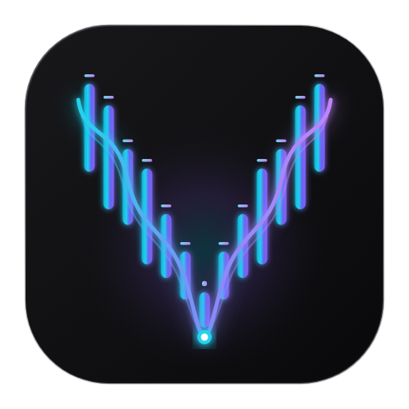
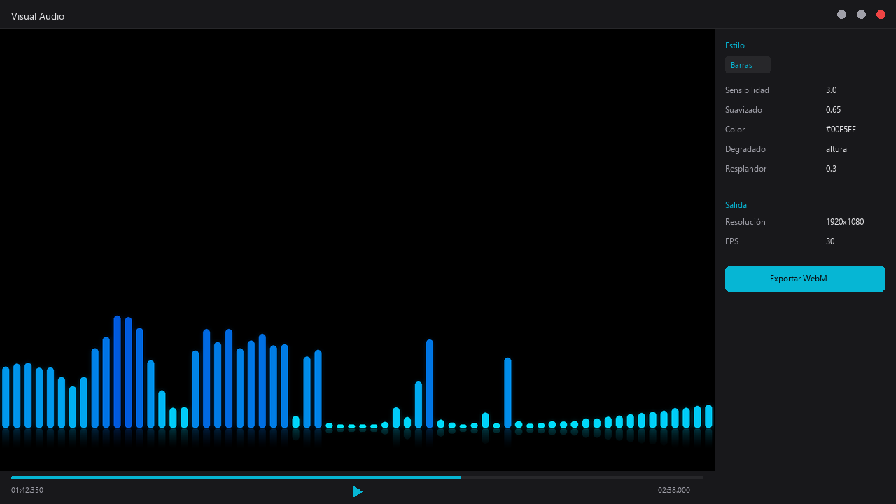
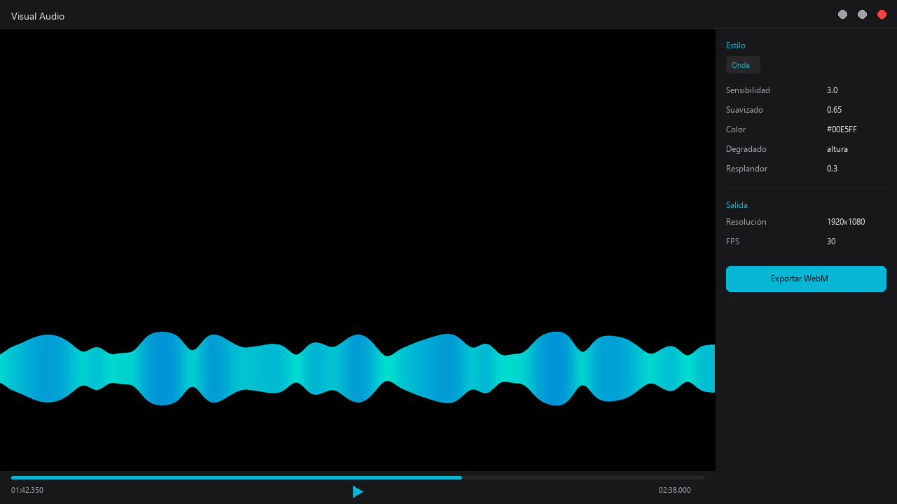
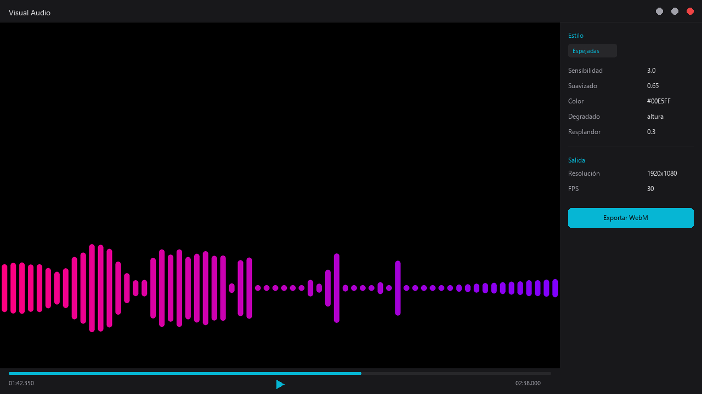

<p align="center">
  
</p>

<h1 align="center">Visual Audio</h1>

<p align="center">
  <em>Visualizador de audio reactivo de alto rendimiento para Drift y suites de video.</em>
</p>

<p align="center">
  
  
  
  
  
  
</p>

---

## Qué es Visual Audio

Visual Audio genera overlays de audio-reactividad (espectrograma FFT y osciloscopio de onda) con precisión matemática, soporte de canal transparente / modo Trama y previsualización interactiva a 60 fps con pre-bake en tiempo constante O(1).

**En una línea:** Cargás tu canción, elegís un estilo, escuchás la música sincronizada en tiempo real y exportás un video WebM listo para componer en Drift (o cualquier editor de video).

### Características principales

- **3 estilos de visualización:** Barras de frecuencia, Barras espejadas y Onda simétrica.
- **Previsualización en tiempo real:** Viewport LOD a 60 FPS con reproductor de audio sincronizado (play, pausa, scrubbing).
- **Exportación determinista:** Lo que ves en la vista previa es exactamente lo que se exporta (MVP-5).
- **Composición perfecta en Drift:** Fondo negro + modo de fusión Trama (Screen) con compensación de color automática.
- **Presets de fábrica:** Barras Neón, Barras Blancas, Espejadas Frecuencia, Onda Suave — y podés crear los tuyos.
- **Tema Dark Zinc 950/900:** Interfaz moderna con acentos cian y violeta.

---

## Galería

<table>
  <tr>
    <td align="center"><strong>Barras de frecuencia</strong></td>
    <td align="center"><strong>Onda simétrica</strong></td>
  </tr>
  <tr>
    <td></td>
    <td></td>
  </tr>
  <tr>
    <td align="center" colspan="2"><strong>Barras espejadas</strong></td>
  </tr>
  <tr>
    <td colspan="2" align="center"></td>
  </tr>
</table>

---

## Instalación (Windows)

### Requisitos previos

1. **Python 3.10 o superior**
   - Descargá desde [python.org](https://www.python.org/downloads/).
   - **Importante:** Marcá la casilla *"Add Python to PATH"* durante la instalación.

2. **FFmpeg**
   - Descargá desde [ffmpeg.org](https://ffmpeg.org/download.html) o con `winget install ffmpeg`.
   - Asegurate de que `ffmpeg.exe` y `ffplay.exe` estén accesibles en el PATH del sistema.

### Pasos

```powershell
# 1. Clonar el repositorio
git clone https://github.com/tu-usuario/visual-audio.git
cd visual-audio

# 2. Instalar dependencias de Python
pip install -r requirements.txt

# 3. Instalar localmente (requerido para que Python encuentre el módulo en tools/)
pip install -e .

# 4. Verificar que funciona
python -m visualizador --version
```

---

## Modo de uso

### Interfaz gráfica (recomendado)

Hacé doble clic en **`visualizador.bat`** en la raíz del repositorio. Se abre la aplicación de escritorio sin consolas de fondo.

> **Nota:** El script `visualizador.bat` agrega automáticamente la carpeta `tools/` al `PYTHONPATH`. Puede ser usado como alternativa directa si no querés hacer la instalación con `pip install -e .`.

```powershell
# O desde la terminal (requiere haber ejecutado pip install -e . previamente):
python -m visualizador
```

1. Cargá tu canción (WAV, MP3, FLAC, OGG o cualquier formato que soporte FFmpeg).
2. Elegí un estilo y ajustá los parámetros a gusto.
3. Escuchá la música sincronizada en tiempo real con el reproductor integrado.
4. Exportá el video WebM.

### Línea de comandos (CLI)

```powershell
# Render básico con preset de fábrica
python -m visualizador mi_cancion.wav -o salida.webm --preset barras_neon

# Personalizar parámetros
python -m visualizador mi_cancion.wav -o salida.webm --estilo onda --color "#00FFCC" --grosor_linea 4
```

### Composición en Drift

1. Exportá el video WebM desde Visual Audio.
2. Importá el archivo `.webm` en Drift 0.6.0+ y ubicalo en una pista por encima del video.
3. Poné el modo de fusión en **Trama (Screen)**.
4. El fondo negro desaparece de forma exacta y el overlay queda compuesto.

> **Nota:** Drift 0.6.0 no procesa video con canal alpha nativo en el timeline. El método estándar verificado es fondo negro + fusión Trama. Cuando esté disponible Drift 0.7.0, el modo `--fondo transparente` ya está construido en el motor y listo para usarse.

Para detalles sobre compensación de color y ajuste fino, consultá [`docs/GUIA_DE_USO.md`](docs/GUIA_DE_USO.md) y [`docs/COLOR_EN_TRAMA.md`](docs/COLOR_EN_TRAMA.md).

---

## Estilos y presets

### Estilos de visualización

| Estilo | Descripción | Parámetros clave |
|--------|-------------|------------------|
| **Barras** | Espectro de frecuencias como barras verticales | Color, degradado, resplandor, reflejo, redondeo |
| **Espejadas** | Barras de frecuencia espejadas simétricamente | Color, degradado, redondeo |
| **Onda** | Forma de onda como curva continua (osciloscopio) | Color, grosor de línea, relleno, degradado |

### Presets de fábrica

| Preset | Estilo | Aspecto |
|--------|--------|---------|
| `barras_neon` | Barras | Cian a azul con resplandor y reflejo |
| `barras_blancas` | Barras | Blanco puro sobre negro, sin degradado |
| `espejadas_frecuencia` | Espejadas | Rosa a violeta con redondeo |
| `onda_suave` | Onda | Verde agua con relleno y degradado vertical |

Podés crear tus propios presets guardando un archivo JSON en la carpeta `presets/`. La estructura es simple:

```json
{
  "version": 1,
  "estilo": "barras",
  "params": {
    "color": "#00E5FF",
    "degradado": "altura",
    "resplandor": 0.3
  }
}
```

---

## Documentación

| Documento | Contenido |
|-----------|-----------|
| [`docs/GUIA_DE_USO.md`](docs/GUIA_DE_USO.md) | Guía completa de uso de la aplicación |
| [`docs/COMO_USAR.md`](docs/COMO_USAR.md) | Instrucciones rápidas |
| [`docs/ARQUITECTURA.md`](docs/ARQUITECTURA.md) | Arquitectura técnica y contratos |
| [`docs/COLOR_EN_TRAMA.md`](docs/COLOR_EN_TRAMA.md) | Álgebra de color en modo Trama |

---

## Estructura del repositorio

```
.
├── visualizador.bat         Lanzador de doble clic para Windows (sin consola negra)
├── LICENSE                  PolyForm Noncommercial License 1.0.0
├── README.md                Esta documentación
├── requirements.txt         Dependencias de Python
├── presets/                 Presets de fábrica JSON
├── assets/
│   ├── logo/                Logo oficial (SVG, PNG, ICO)
│   └── screenshots/         Capturas de pantalla oficiales
├── tools/
│   └── visualizador/        Paquete principal de la aplicación
│       ├── __main__.py      Entrypoint (python -m visualizador)
│       ├── gui.py           Interfaz gráfica (Tkinter)
│       ├── cli.py           Línea de comandos
│       ├── analisis.py      Motor de análisis espectral FFT
│       ├── render.py        Motor de renderizado determinista
│       ├── salida.py        Exportación WebM vía FFmpeg
│       ├── proyecto.py      Persistencia de proyectos y presets
│       ├── parametros.py    Esquema declarativo de parámetros
│       └── estilos/         Implementaciones de estilos
├── tests/                   Suite de pruebas automatizadas
└── docs/                    Documentación técnica y guías
```

---

## Licencia

**PolyForm Noncommercial License 1.0.0**

Visual Audio es software de uso libre para propósitos no comerciales. Podés usarlo, estudiarlo, modificarlo y compartirlo libremente.

**Permitido:** Usar Visual Audio para producir tus videos musicales, visualizaciones y contenido creativo, incluso en canales con monetización publicitaria activa. El software es tu herramienta; los videos que producís son tuyos.

**Prohibido:** Vender este software, cobrar por licencias, empaquetarlo dentro de un producto comercial de pago, o prestarlo como servicio de pago (SaaS).

Consultá el archivo [`LICENSE`](LICENSE) para el texto legal completo.

---

## Créditos

Creado por **Jonatan Córdoba**.

Visual Audio es un proyecto independiente. No forma parte de [CutWire Studios](https://github.com/CutWire-Studios) ni del equipo de desarrollo de [Drift](https://github.com/CutWire-Studios/Drift). Es una herramienta complementaria externa que produce metraje compatible para ser compuesto en la línea de tiempo de Drift.
