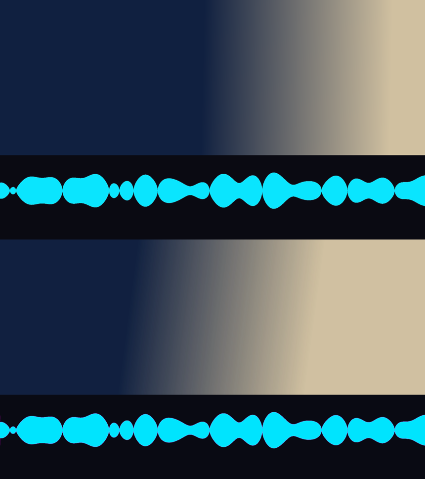

# Cómo usar el visualizador

Guía de uso para Drift **0.6.0**, que es la versión publicada y la que tenés instalada.

> **Por qué hay dos pasos y no uno.** Drift 0.6.0 **no soporta video con canal alpha**: si le das un archivo transparente, descarta el alpha y compone el clip como un rectángulo negro. Verificado, con evidencia, en `POC_RESULTADOS.md`. El soporte existe en la rama de desarrollo de Drift (0.7.0, sin publicar todavía). Hasta que salga, la transparencia la resuelve Drift con una herramienta que ya tiene: un modo de fusión, o el efecto Chroma Key.

---

## Lo más simple: fondo negro + fusión Trama

Dos comandos y un menú.

### 1. Generar

```powershell
python tools\generar_overlay.py "mi_cancion.mp3" -o "onda.webm" --lienzo 1920x1080
```

Eso produce `onda.webm`: la onda en blanco sobre fondo negro, del tamaño exacto del proyecto, con la banda abajo.

### 2. En Drift

1. Importá `onda.webm` y ponelo en una pista **por encima** del video.
2. Con el clip seleccionado, poné el modo de fusión en **Trama**.

Listo. El negro desaparece porque en modo Trama el negro no aporta nada, y queda la onda sobre el video.

### Lo que hay que saber de este método

- **Aclara la imagen** donde está la onda. Es inherente al modo Trama.
- **Sobre partes claras del video la onda se pierde.** Si tu material es luminoso, usá el método de Chroma Key.
- A cambio: no hay efectos que agregar, no hay nada que ajustar, y no hay bordes sucios.

---

## Para que funcione sobre cualquier fondo: Chroma Key

Da transparencia de verdad y no altera los colores, a cambio de un paso más.

### 1. Generar con fondo de color

```powershell
python tools\generar_overlay.py "mi_cancion.mp3" -o "onda.webm" --lienzo 1920x1080 `
    --fondo color --color-fondo "#FF00FF" --color "#00E5FF"
```

**Elegí el color de fondo lejos del color de la onda.** El Chroma Key de Drift recorta por **tono**, así que si los dos tonos están cerca se va a comer parte del dibujo. Con la onda cian (`#00E5FF`, tono ~186°), el magenta (`#FF00FF`, tono 300°) queda a 114° de distancia; el verde quedaría a sólo 66°.

Referencia rápida de tonos:

| Color | Hex | Tono |
|---|---|---|
| Rojo | `#FF0000` | 0° |
| Verde | `#00FF00` | 120° |
| Cian | `#00FFFF` | 180° |
| Azul | `#0000FF` | 240° |
| Magenta | `#FF00FF` | 300° |

### 2. En Drift

1. Importá el archivo y ponelo en una pista **por encima** del video. Modo de fusión **Normal**.
2. Agregale el efecto **Chroma Key** (categoría *keying*).
3. Ajustá **Key Colour** al tono de tu fondo: **300** para magenta, 120 para verde.
4. Subí **Tolerance** hasta que el fondo desaparezca.
5. Si quedan bordes de color, subí **Edge Softness** y **Spill Removal**.

### Lo que hay que saber de este método

- Puede dejar un **borde teñido** alrededor de la onda. Se ataca con Edge Softness y Spill Removal.
- Si el tono de la onda queda cerca del tono del fondo, **el recorte se come parte del dibujo**. Por eso importa elegir bien los colores.

---

## Cómo se ven las dos



Arriba con fusión Trama, abajo con Chroma Key, sobre el mismo fondo. Prácticamente indistinguibles cuando la onda está sobre una zona oscura. La diferencia aparece sobre zonas claras, donde Trama se lava y Chroma Key no.

Son simulaciones hechas con FFmpeg, no capturas de Drift: sirven para ver el resultado esperado.

---

## Personalizar

De las cinco personalizaciones que pediste, **tres las hace Drift** con sus propios controles, sobre el clip ya colocado:

| | Dónde |
|---|---|
| **Tamaño** | Transform del clip en Drift. Keyframable |
| **Posición** | Transform del clip en Drift, o `--posicion` / `--margen` al generar |
| **Opacidad** | Propiedad Opacity del clip en Drift. Keyframable |
| **Color** | `--color` al generar |
| **Velocidad** | Speed curve del clip en Drift |

### Opciones del generador

```powershell
# Ver todo
python tools\generar_overlay.py --help
```

Las que más vas a usar:

| Opción | Qué hace |
|---|---|
| `--color "#RRGGBB"` | Color de la onda |
| `--lienzo 1920x1080` | Genera el cuadro completo del proyecto. **Usalo siempre**: evita que Drift tenga que escalar o rellenar |
| `--posicion {arriba,centro,abajo}` | Dónde va la banda. Default: abajo |
| `--margen PX` | Separación del borde |
| `--alto PX` | Alto de la banda de onda. Default 320 |
| `--modo {cline,p2p,line,point}` | Forma del dibujo. `cline` es simétrica, `p2p` un contorno fino |
| `--escala {sqrt,lin,cbrt,log}` | Cuánto se levantan los pasajes suaves. `sqrt` es un buen punto medio |
| `--fps` | Default 30. Bajalo a 24 si querés archivos más chicos |
| `--crf` | Calidad. Más alto = más chico. Default 36 |

### Si el archivo pesa mucho

Un tema real: el overlay pesa bastante porque cada cuadro de la onda es un dibujo nuevo y la compresión de video no puede predecirlo. Palancas, de mayor a menor efecto:

1. `--alto 200` — una banda más baja tiene menos que dibujar.
2. `--fps 24`.
3. `--crf 44`.

Dato medido sobre 16 segundos a 1920×1080: fondo negro 5,5 MB, fondo de color 3,2 MB. El mismo material con canal alpha pesaba 11,7 MB — así que el camino que funciona en tu versión es además **el más liviano**.

---

## Cuando salga Drift 0.7.0

Va a soportar canal alpha, y entonces desaparece el paso extra:

```powershell
python tools\generar_overlay.py "mi_cancion.mp3" -o "onda.webm" --lienzo 1920x1080 --fondo transparente
```

Importás, ponés encima, y listo — sin modo de fusión ni Chroma Key. La opción ya está implementada y verificada; sólo falta que la versión de Drift la soporte.

---

## Verificar que todo está bien

El generador se verifica solo al terminar y devuelve error si algo falla. Además:

```powershell
# La onda está sincronizada con la música
python tests\verificar_sincronia.py
```

Si esa prueba falla, algo se rompió en el generador y **no** hay que confiar en los archivos que produzca.
