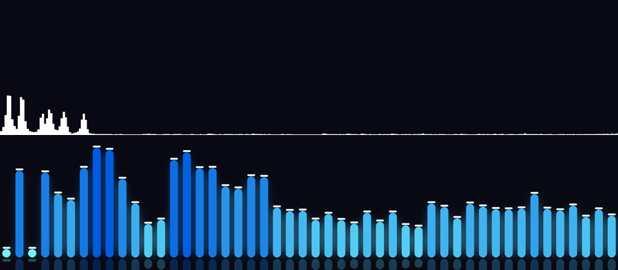

# Decisión pendiente — qué motor dibuja el visualizador

**Estado: PROPUESTA — pendiente del fundador.**
**Fecha:** 2026-09-25 · **Turno:** T5 · **Agente:** Kiro

El fundador planteó cuatro preguntas al cerrar T4. Este documento responde las que son de hecho y plantea la única que es una decisión suya.

---

## 1. ¿La prueba de concepto falló?

**No.** Conviene separar el criterio del objetivo, porque el que falló fue un criterio que yo escribí mal.

| # | Criterio | Estado |
|---|---|---|
| PoC-1 | Genera el archivo sin error | ✅ |
| PoC-2 | El archivo lleva la transparencia declarada | ✅ |
| PoC-3 | Duración y sincronía exactas | ✅ (y se encontró y corrigió un desfase de 100 ms) |
| PoC-4 | Drift lo importa | ✅ |
| PoC-5 | *"Drift compone la transparencia"* | ❌ **como está escrito** |
| PoC-6 | La onda se mueve con la música | ✅ |

**Por qué PoC-5 está mal escrito:** lo redacté asumiendo que el canal alpha era la única forma de poner el visualizador sobre el video. No lo es. El objetivo que ese criterio protegía era *"se puede poner el visualizador sobre el video dentro de Drift"*, y eso **quedó demostrado por el propio fundador**: aplicó el modo Trama sobre un archivo que ni estaba diseñado para eso, y vio la onda cian sobre su video. Esa fue la prueba.

Redacción corregida, para registrar:

> **PoC-5:** el visualizador se compone sobre el video dentro de Drift, respetando la transparencia por cualquiera de los mecanismos que Drift ofrezca (canal alpha, modo de fusión, o recorte por color).

Con esa redacción: **cumplido**. Y el documento fundacional pedía para el PoC *"capturar el audio y poder expresar su movimiento de forma rudimentaria"* — eso está hecho.

Queda pendiente que el fundador confirme los archivos **D** y **E**, que son los diseñados a propósito para cada mecanismo en vez de funcionar por accidente.

---

## 2. ¿Es cierto que no se puede personalizar cómo se ven las ondas?

**No, y es la premisa que más importa corregir.**

El fundador escribió: *"no es probable hacer un plugin que nos permita editar como se ven la ondas de sonidos, mas alla de ajuste como posicion, tamaño, opacidad"*.

Al revés. **Nosotros dibujamos los píxeles**, así que el aspecto es enteramente nuestro: forma, color, cantidad de barras, grosor, separación, puntas redondeadas, degradados, resplandor, reflejo, tapas de pico, mapeo de frecuencias, suavizado temporal. Todo.

Lo que aportan Drift y nosotros es complementario, no competitivo:

| | Quién lo hace | Cuándo se ajusta |
|---|---|---|
| Posición, tamaño, opacidad, velocidad | **Drift**, con sus controles de clip | En vivo, arrastrando |
| **Todo el aspecto del dibujo** | **Nuestro generador** | Al generar (segundos) |

Posición, tamaño y opacidad no son *el límite* de lo que se puede personalizar: son **lo que sale gratis** porque Drift ya lo hace bien. El aspecto no está limitado — sólo no se ajusta con un deslizador en vivo dentro de Drift.

La única limitación real es esa: **el aspecto se define al generar, no se previsualiza en vivo dentro de Drift.** Cambiar un color son segundos de render, no un arrastre de mouse.

---

## 3. ¿Trabajar para 0.6.0 o para 0.7.0?

**No hay que apostar. Ya está resuelto, y cuesta cero mantenerlo así.**

La diferencia entre las dos versiones está encapsulada en **un parámetro**:

```powershell
--fondo negro          # 0.6.0: se compone con el modo Trama
--fondo color          # 0.6.0: se recorta con el efecto Chroma Key
--fondo transparente   # 0.7.0+: canal alpha, sin pasos extra
```

Los tres están implementados y verificados. Todo el trabajo de verdad —análisis de audio, dibujo, posicionado, sincronía— es **idéntico** en los tres casos. Cuando salga 0.7.0 se cambia un default y nada más.

### Dato sobre cuándo, para no especular

Ritmo de publicación de Drift, de la API de GitHub:

| Versión | Fecha | Días desde la anterior |
|---|---|---|
| v0.1.0 | 2026-07-30 | — |
| v0.2.0 | 2026-08-07 | 8 |
| v0.3.0 | 2026-08-20 | 13 |
| v0.4.0 | 2026-08-24 | 4 |
| v0.5.0 | 2026-08-30 | 6 |
| v0.6.0 | **2026-09-13** | 14 |

Promedio entre versiones menores: **~9 días**, máximo observado 14. La 0.6.0 tiene **12 días** al 2026-09-25, así que 0.7.0 está en ventana. La intuición del fundador está bien fundada.

**Pero eso no cambia la recomendación**, porque no dependemos de que salga: el default de hoy funciona en su versión, y el camino de 0.7.0 ya está listo.

---

## 4. La decisión de verdad: qué motor dibuja

Esta sí es una decisión, y cambia el presupuesto.

Aclaración previa: la herramienta **ya es externa**. `tools/generar_overlay.py` corre fuera de Drift. La pregunta no es *externa o no*, sino **qué dibuja el visualizador**.

### Opción 1 — Seguir con los filtros de FFmpeg

Es lo que hay hoy. `showwaves` para la onda, `showfreqs` / `showspectrum` para el espectro.

- ✅ Ya funciona para forma de onda, y funciona bien.
- ✅ Costo cero: está hecho.
- ❌ **El espectro es inservible.** Medido: `showfreqs` amontona todo en el 15% izquierdo del cuadro e ignora el color pedido.
- ❌ **Sin control del aspecto.** No hay grosor de barra, ni separación, ni puntas redondeadas, ni degradado, ni resplandor, ni reflejo, ni tapas de pico. Es lo que FFmpeg da y nada más.
- ❌ No es lo que el fundador valoraba de After Effects.

### Opción 2 — Motor propio: analizar y dibujar nosotros ⭐ recomendado

Separar el análisis del audio (FFT por bandas) del dibujo (render 2D propio). Cada cuadro se dibuja con código nuestro y se le pasa a FFmpeg sólo para codificar.

- ✅ **Control total del aspecto.** Es la respuesta a lo que el fundador quería de AE.
- ✅ Sin suscripción, sin instalar nada: `numpy` y `Pillow` ya están en la máquina.
- ✅ Rápido. Una canción de 3 minutos son 5400 cuadros; el dibujo es del orden de milisegundos por cuadro.
- ✅ Crece bien: agregar un estilo nuevo es agregar una función de dibujo.
- ❌ Más turnos que la opción 1.
- ❌ El código es nuestro, así que los bugs también.

### La evidencia, en vez de la promesa



**El mismo instante del mismo audio.** Arriba `showfreqs` de FFmpeg pidiéndole explícitamente color cian, 4096 de ventana y escala logarítmica de frecuencia: una mancha blanca apretada contra el borde izquierdo y una línea plana en el resto.

Abajo, un prototipo de unas 100 líneas con `numpy` y `Pillow`: 48 barras en bandas logarítmicas de 40 Hz a 14 kHz, degradado por altura, puntas redondeadas, tapas de pico, resplandor y reflejo atenuado.

No es que FFmpeg esté mal configurado — es que ese filtro no expone nada de lo que hace falta.

### Opción 3 — Usar otra herramienta de terceros

Se consideró y no se recomienda:

- **Blender** es libre y puede hacer visualizadores guiados por audio, pero es un programa enorme para esto, con su propia curva de aprendizaje, y automatizarlo es más frágil que dibujar 48 rectángulos.
- Los generadores web gratuitos suelen tener marca de agua, poco control, o requieren subir el audio.
- Cualquier herramienta de terceros reintroduce el problema que el fundador quería resolver: depender de algo que no controla.

Ya tenemos el análisis de audio resuelto y FFmpeg para codificar. Lo único que falta es el dibujo, y es la parte que menos conviene delegar, porque es exactamente donde vive la personalización.

---

## Presupuesto revisado, si se elige la opción 2

El plan original (`PLAN_ETAPA1.md` §4) asignaba **T6–T9, cuatro turnos** al MVP, asumiendo que el espectro salía de un filtro de FFmpeg. Con motor propio:

| Tramo | Turnos | Entrega |
|---|---|---|
| Análisis de audio a bandas, reutilizable | 1 | Bandas logarítmicas por cuadro, con suavizado de ataque y caída |
| Motor de dibujo y estilo "barras" | 2 | Barras con grosor, separación, puntas, degradado, resplandor, reflejo, tapas de pico |
| Estilo "onda" en el motor propio | 1 | Reemplaza `showwaves` con control real |
| Presets y documentación | 1 | Presets con nombre, guía actualizada |
| Validación con el fundador | 1 | MVP-3 y MVP-4 |
| **Total** | **6** | contra los 4 del plan original |

**Dos turnos más que lo aprobado**, y quedan las reservas del plan (2–3 turnos). Encaja en el presupuesto de 10–14 turnos ya aprobado; el aviso es que consume la reserva.

Se puede **conservar el camino de FFmpeg** para forma de onda como modo rápido, ya que funciona y no cuesta mantenerlo.

---

## Lo que necesito que decida el fundador

1. **¿Motor propio (opción 2) o seguir con los filtros de FFmpeg (opción 1)?**
2. **¿Acepta los 6 turnos** del MVP en vez de 4, consumiendo parte de la reserva?
3. **¿Confirma D y E** en Drift, para cerrar PoC-5 con la redacción corregida?

Lo demás no requiere decisión: la estrategia de versiones ya está resuelta con un parámetro.
