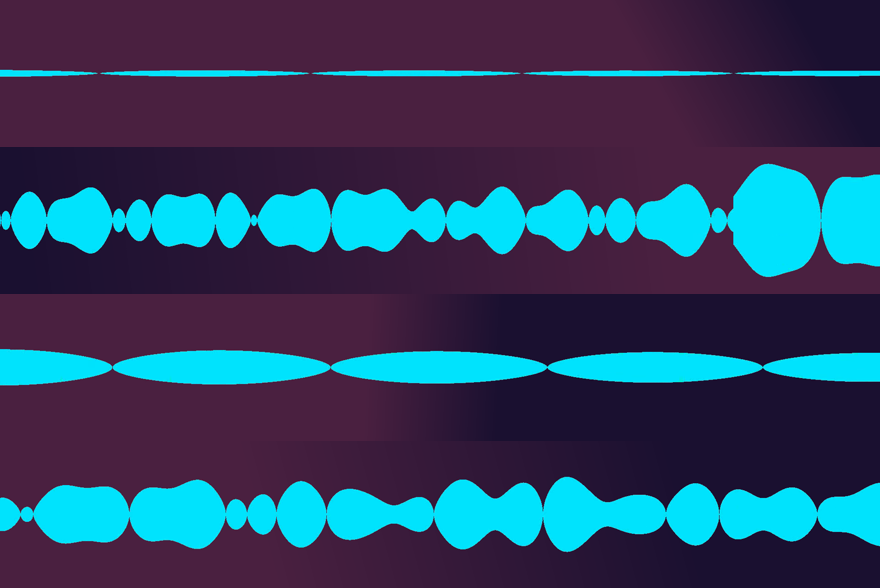
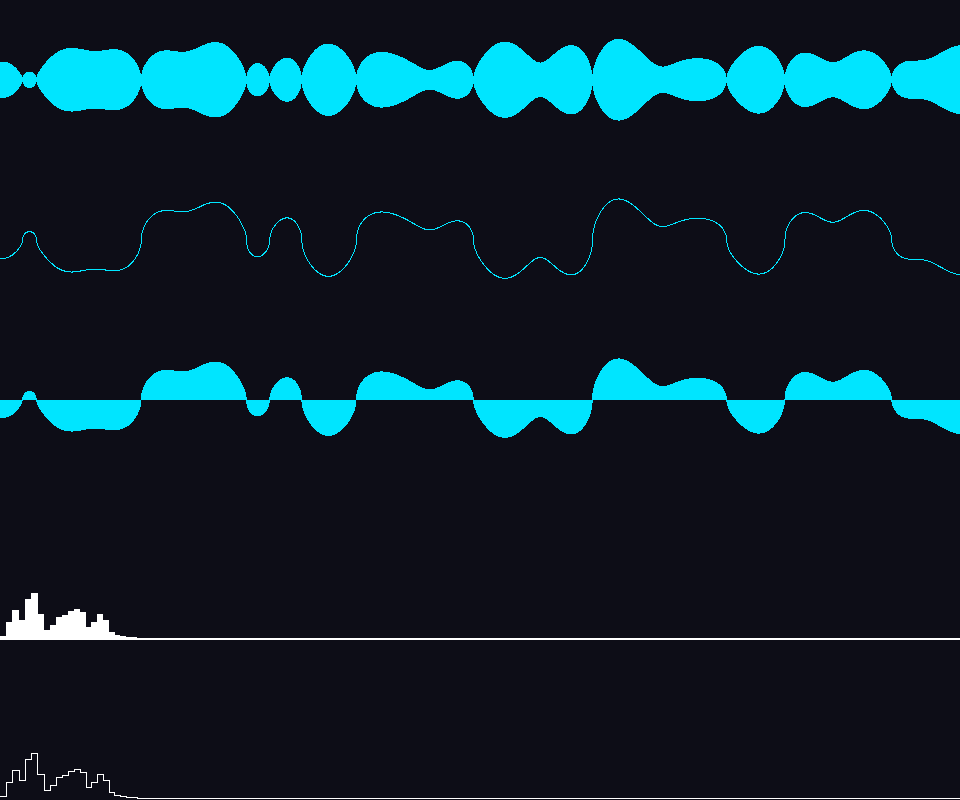

# Resultados de la Prueba de Concepto

**Fecha:** 2026-09-25 · **Turnos:** T2–T4 · **Agente:** Kiro
**Criterios de referencia:** `PLAN_ETAPA1.md` §2

---

## Estado: PoC-1, PoC-2 y PoC-3 cumplidos. PoC-4, PoC-5 y PoC-6 requieren Drift abierto.

| # | Criterio | Estado | Medición |
|---|---|---|---|
| PoC-1 | Genera un `.webm` desde un `.wav` sin error | ✅ | exit 0, 11.582.236 bytes |
| PoC-2a | El contenedor declara canal alpha | ✅ | `alpha_mode='1'` |
| PoC-2b | El alpha varía de verdad (hay transparente y opaco) | ✅ | t=0.50s: min 0, max 255, 96.8% transparente · t=11.20s: min 0, max 255, 70.6% transparente |
| PoC-3 | Duración del overlay = duración del audio (±1 cuadro) | ✅ | 16.000s vs 16.000s, **desvío 0.0 ms** (tolerancia 33.3 ms) |
| PoC-4 | Drift lo importa sin marcarlo como faltante ni corrupto | ⏸️ | **requiere Drift abierto** |
| PoC-5 | **Drift lo compone con transparencia** | ⏸️ | **requiere Drift abierto — es el criterio que decide el camino A** |
| PoC-6 | La onda se mueve en sincronía con la música | ⏸️ | requiere que el fundador la mire |

### Reproducir

```powershell
python tools\generar_overlay.py tests\fixtures\pista_prueba.wav -o build\onda_prueba.webm --color "#00E5FF"
```

El propio script verifica PoC-1 a PoC-3 al terminar y devuelve código 1 si alguno falla.

---

## Evidencia visual



Cuatro momentos de `tests/fixtures/pista_prueba.wav`, con el overlay compuesto sobre un fondo degradado **por FFmpeg** (no por Drift — eso es PoC-5). De arriba abajo:

| Momento | Qué hay en el audio ahí | Qué muestra la onda |
|---|---|---|
| 1.5 s | Sólo kick y hats, sin bajo ni acorde | Un hilo fino: poca energía, y se ve |
| 5.0 s | Kick, hats, bajo y acorde menor | Cuerpo lleno con amplitud variable |
| 8.2 s | El "respiro" del compás 4: un solo kick | Lóbulos anchos y suaves — es la oscilación grave del kick sin nada encima |
| 11.2 s | Tramo intenso, semicorcheas | Onda densa y de amplitud alta |

Los cuatro tramos se distinguen entre sí y **el fondo se ve a través del overlay**. Eso valida el archivo; que Drift lo componga igual es lo que falta probar.

---

## Tres cosas que salieron mal, y qué eran

Vale la pena registrarlas: las tres parecían fallas del formato o del codec y ninguna lo era. Un agente futuro que toque el generador se va a ahorrar el diagnóstico.

### 1. `-shortest` no corta un `filter_complex`

**Síntoma:** el primer intento no terminaba nunca. Lo matamos cuando el archivo llevaba **21 MB** de un audio de 16 segundos.

**Causa:** el diseño original combinaba una fuente `color` plana con la onda. Una fuente `color` sin `d=` es **infinita**, y `-shortest` no la acota cuando la salida sale de un `filter_complex`.

**Resolución:** el problema desapareció al eliminar la fuente `color` entera (ver punto 2). El generador igual pasa `-t` con la duración exacta del audio, porque `showwaves` se pasa unos cuadros por su cuenta: medido, **16.100 s para un audio de 16.000 s**.

### 2. `alphamerge` devolvía alpha 255 en todo el cuadro — y no hacía falta

**Síntoma:** la máscara de la onda era correcta (medido: min 0, max 204, 76.790 de 76.800 píxeles en negro), pero después de `alphamerge` el alpha era 255 en todo el cuadro. Opaco entero.

**Causa raíz:** no la buscamos, porque al investigar apareció algo mejor: **`showwaves` ya emite RGBA con el fondo transparente.** Toda la cadena de "dibujar en blanco → convertir a máscara gris → generar color plano → combinar" era innecesaria.

**Resolución:** el filtro quedó en una sola línea. Menos partes, menos superficie de falla.

> **Para el próximo agente:** si se te ocurre usar `alphamerge` para colorear un visualizador, ya se intentó y no funcionó. `showwaves` acepta `colors=` y devuelve el alpha correcto solo.

### 3. `draw=full` no es opcional

**Síntoma:** el alpha existía pero llegaba sólo a **153 de 255, sin un solo píxel opaco**. La onda se habría visto lavada.

**Causa:** el default de `showwaves` es `draw=scale`, que **reparte** la intensidad entre las muestras que caen en cada columna. A 48 kHz y 30 fps son ~1600 muestras por cuadro, así que a resolución alta dibuja un pelo casi invisible. No era el codec: se verificó en PNG sin pérdida, donde el resultado es idéntico.

**Medición, con cuadro establecido** (importante — ver más abajo), 1920x320 en el segundo 11.2:

| `draw` | alpha máx | píxeles opacos | transparentes |
|---|---|---|---|
| `scale` (default de FFmpeg) | 153 | **0** | 70.8% |
| `full` (nuestro default) | **255** | 179.173 | 70.8% |

Misma cantidad de transparentes, pero con `full` la onda es sólida. `--trazo scale` sigue disponible por si alguien quiere el trazo tenue.

---

## Una trampa de medición que casi nos hizo sacar la conclusión equivocada

Medir un cuadro con `ffmpeg -ss <t> -i audio -filter_complex showwaves=... -frames:v 1` **da un cuadro incompleto.** Después de un salto temporal, `showwaves` arranca con el buffer vacío y el primer cuadro sale con la onda apretada contra un borde y el resto plano.

Con eso llegamos a mirar una imagen que parecía mostrar un visualizador roto, cuando el problema era el método de medición. **Se detectó porque el dibujo no tenía sentido físico**, no porque los números fallaran.

**Cómo medir bien:** seleccionar un cuadro ya establecido en vez de saltar.

```powershell
# MAL: el primer cuadro después del salto está incompleto
ffmpeg -ss 11.2 -i audio.wav -filter_complex "[0:a]showwaves=..." -frames:v 1 mal.png

# BIEN: dejar correr el filtro y elegir el cuadro 336 (= 11.2 s a 30 fps)
ffmpeg -i audio.wav -filter_complex "[0:a]showwaves=...[v];[v]select='gte(n\,336)'" -frames:v 1 bien.png
```

Saltar sobre el `.webm` **ya codificado** sí es correcto: ahí el salto es a un cuadro real y se decodifica completo. Es lo que hace la verificación automática del generador.

---

## Medir el canal alpha de un WebM sin engañarse

`ffprobe` reporta `pix_fmt=yuv420p` en un WebM **que sí tiene alpha**. No es un error de ffprobe: en WebM el alpha de VP9 viaja como datos adicionales de cada bloque, no en el bitstream principal. Mirar ese campo da un **falso negativo**, y nos lo dio.

Las dos formas correctas, las dos implementadas en el generador:

```powershell
# 1) La marca del contenedor
ffprobe -v error -select_streams v:0 -show_entries stream_tags=alpha_mode -of csv=p=0 overlay.webm
# -> 1

# 2) Decodificar de verdad y medir. El -c:v libvpx-vp9 ANTES de -i no es opcional:
#    el decodificador nativo de vp9 ignora el plano alpha en silencio.
ffmpeg -c:v libvpx-vp9 -i overlay.webm -vf alphaextract -frames:v 1 -f rawvideo -pix_fmt gray -
```

Que haya que forzar `libvpx-vp9` no es casualidad: **Drift hace exactamente lo mismo** en `src/engine/ClipReader.cpp:1002-1010`, con el comentario de que los decodificadores nativos vp9/vp8 ignoran el plano alpha de WebM. La verificación se parece a lo que va a ver Drift.

---

## Lo que el PoC dejó sin resolver

### El peso del archivo

11.6 MB por 16 segundos. Extrapolado, una canción de 3 minutos da **~130 MB**.

El motivo es estructural: cada cuadro de `showwaves` es una ventana de onda nueva, no un desplazamiento de la anterior, así que la compresión temporal de VP9 no tiene de dónde agarrarse. Bajar la calidad ayuda poco:

| `--crf` | Tamaño (16 s) | Alpha |
|---|---|---|
| 30 | 13.7 MB | max 255, 70.8% transparente |
| **36 (default)** | **11.0 MB** | max 255, 70.6% transparente |
| 42 | 8.4 MB | max 255, 70.4% transparente |
| 48 | 6.1 MB | max 255, 70.1% transparente |

Se eligió **36** como default: 20% menos que 30 sin degradación medible del alpha. Importa más de lo que parece, porque **Drift no usa proxy de preview en clips con transparencia** (`PreviewProxyRenderer.cpp:40-45`), así que el overlay se decodifica por software. Cuánto pesa eso en la práctica se mide en T5.

Palancas para el MVP, en orden de rendimiento esperado: bajar `--alto`, bajar `--fps` a 24, o `--crf` más alto.

### Los modos de espectro no están listos



De arriba abajo: `cline`, `p2p`, `line`, `showfreqs` en modo barra, `showfreqs` en modo línea.

Los tres primeros (`showwaves`) funcionan bien. **Los dos de espectro están amontonados en el 12% izquierdo del cuadro** y además ignoran el color pedido. Es un problema de mapeo de frecuencias que hay que resolver, no un default que se pueda ajustar de una.

Queda como trabajo del MVP (criterio MVP-1 pide dos estilos). **No se declara funcionando.** `showspectrum` directamente falló al renderizar un cuadro y tampoco se investigó.

### El color tiene un desvío de ~1.5%

Se pidió `#00E5FF` (R 0, G 229, B 255) y los píxeles opacos salen RGB (0, 225, 255). Cuatro unidades menos en verde. No se investigó porque a simple vista no se distingue, pero queda anotado por si alguna vez importa la fidelidad exacta.

---

## Qué hace falta de Drift, y cuándo

Para PoC-4, PoC-5 y PoC-6 hace falta **Drift abierto**, con:

1. Un video cualquiera en una pista.
2. `build/onda_prueba.webm` importado y puesto en una pista **por encima**.
3. Mirar si el video de fondo se ve a través del overlay.

**No hace falta activar el servidor MCP de Drift.** La importación es manual, arrastrando el archivo. MCP sólo sería necesario para automatizar la colocación, que es opcional del MVP.

**PoC-5 es el punto de control duro del plan.** Si Drift no compone la transparencia como esperamos, el camino A queda invalidado y hay que replantear antes de seguir.
